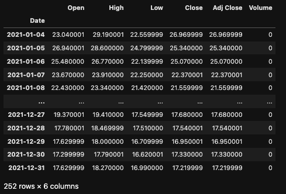
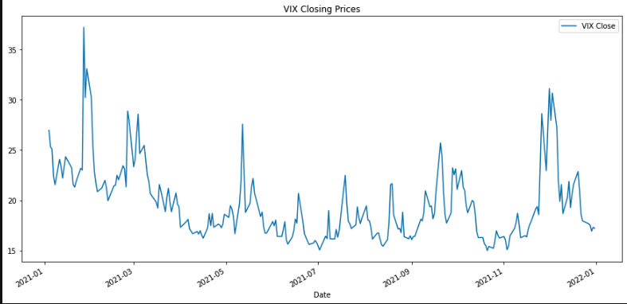
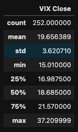
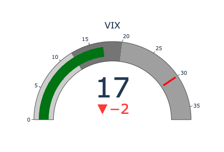

# VIX Guage

### This project allows one to enter their desired 'start' and 'end' dates which then pulls the VIX OHLC (open, high, low, close) data from the yfinance API for those particular days. The results return a dataframe of values for the VIX during that time period, a graph of closing prices over time, and a guage to visualize the current level of the VIX in comparison to the historical data pulled.  

#### Dependencies Used: 
* pandas 
* yfinance
* plotly.graph_objects 

#### Returns: 
1. A preview of the VIX price dataframe values.  

2. Plot of VIX Closing Prices over the specified time period. 

3. A summary of basic stats for the close price.

4. A guage visualization for the current price including a threshold value, used to show the often seen low end top for volatile events. 

